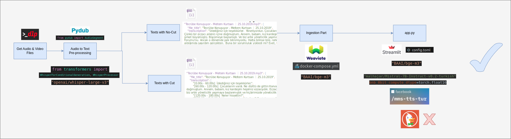
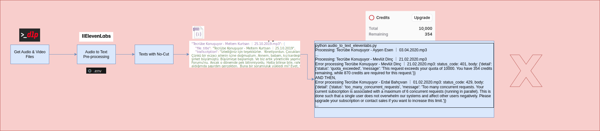
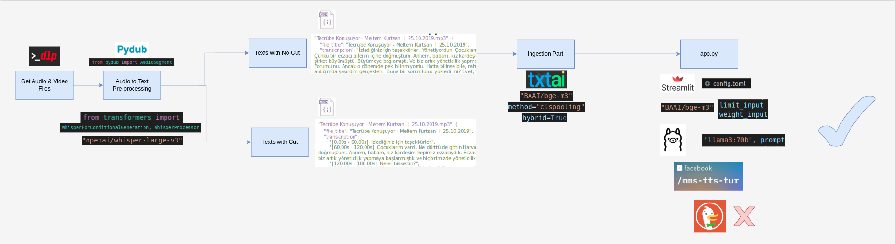

# PRACTICAL PROJECT TASK: LEADERSHIP COACH
## Case Study for AI Engineer Recruitment Process at Enocta

**Berkin ALKAN**  
alkanberkin@gmail.com | +90(539) 200 20 25

### Introduction & Project Overview:

**Project Vision**: Develop a specialized AI Leadership Coach that delivers insightful answers on leadership practices, professional development, and business acumen by leveraging a dedicated knowledge base.

---

# Project Versions and Evaluation

This project has been developed in two main versions: **Version 1** and **Version 2**. Below, you will find explanations of both versions, the preferred data type approach, and project flow diagrams. Additionally, a demo video of the project is available on YouTube.

**I kindly request that the evaluation be conducted based on Version 2.**

## Version 1: Weaviate Server-Client Setup

**Version 1** was implemented using a Weaviate vector database configured as a **server-client architecture** using Docker. This version leverages Weaviate’s powerful features for storing and querying data. The flowchart illustrating this approach is shown below.

## ElevenLabs Approach

This flowchart represents the ElevenLabs approach, showing its structure and how it processes data. However, due to API key limitations and time constraints, I was unable to continue with this approach. Instead, I conducted the analysis within the repository under `version2/data`.

### Version 2: General Project Flowchart

**Version 2** represents the **final and optimized** iteration of the project, incorporating **advanced data processing and analysis techniques** while enhancing the overall **user experience**. This version leverages the **initially preferred** data type method to efficiently process, structure, and analyze data within the system’s architecture.

The **flowchart** below provides a **overview** of the system, illustrating the **data flow**, **key processing stages, and the integration of various components** within the workflow.

## Reason for Transition to Version 2

**Version 2** introduces a more comprehensive and user-friendly approach, improving the overall experience. **Version 1**, which primarily relied on the Weaviate server-client architecture, lacked certain features necessary for the intended application. Additionally, Weaviate was developed on a system with insufficient GPU resources, which posed limitations. As a result, **Version 2** was preferred. Although the **ElevenLabs** approach initially seemed promising, I was unable to continue using it due to API quota limitations.

## YouTube Demo Link

You can watch the project demonstration on YouTube via the following link:  
[Click here to watch the demo](https://www.youtube.com/watch?v=VcuYQdDbBgI&feature=youtu.be&themeRefresh=1).

---

For any inquiries, feel free to contact me. I sincerely appreciate your interest!

